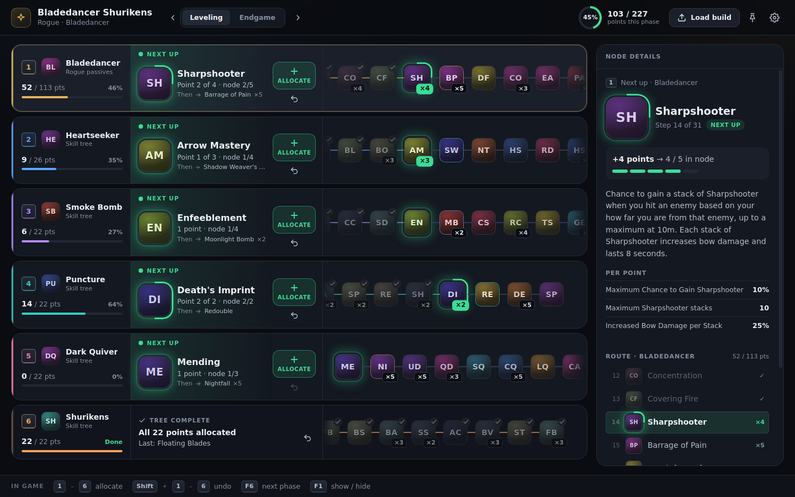

# LE Build Planner

A desktop companion for **Last Epoch**. Load your build from the [Maxroll planner](https://maxroll.gg/last-epoch/planner) (or the in-game export) and follow it point by point: every tree — the passive tree and all five skills — in one view, with the node to allocate **next** in each tree shown big and green.



Built to be read at a glance while you play:

- **One lane per tree.** Each lane has three parts: the tree and its progress, the node to allocate next (with what comes after it), and the full path as a strip of nodes, like the game's own allocation history bar.
- **Green always means "allocate this next".** Done nodes fade, and each tree keeps its colour in every phase.
- **Tick points off without leaving the game.** Global hotkeys work while the game has focus. They're released when the app window is focused, so typing in the app always works.
- **Phases.** Leveling → Endgame (up to 5). Switching phases keeps your progress where the trees overlap, and tells you exactly what to respec in game.
- **Node details.** Description, per-point stats, and the route around any node. *Start from here* catches the app up to a character you've already levelled.
- **Node icons.** Every node shows its in-game icon (see [Node icons](#node-icons)). Nodes without art get a generated glyph.

### Controls

| | In game (global) | In the app |
|---|---|---|
| Allocate a point | `1`–`6` | `1`–`6`, the **Allocate** button, or `Enter` on the focused tree |
| Undo a point | `Shift`+`1`–`6` | `Shift`+`1`–`6`, the undo button, or `Backspace` |
| Next / previous phase | `F6` / `Shift`+`F6` | click the phase, or `PgDn` / `PgUp` |
| Show / hide the window | `F1` | — |
| Move between trees / nodes | — | `↑` `↓` / `←` `→`, `Esc` to go back to Next up |
| Load build · Settings | — | `Ctrl`+`O` · `Ctrl`+`,` |
| Interface size | — | `Ctrl`+`=` / `Ctrl`+`-` / `Ctrl`+`0` |

All global keys can be changed in Settings. **Arm first** mode keeps number keys free for game chat: press `` ` ``, then numbers work for 5 s.

---

## Quick Start

```bash
npm install
npm start          # or: npm run dev (opens DevTools)
npm test
```

Click **Load build**, paste your export codes, and you're set. Or click **Try the example build**.

Your build, progress, settings and saved templates live in the per-user app data folder (`%APPDATA%/le-build-overlay` on Windows), not in the repo. Files from the old overlay's `config/` folder are migrated automatically on first launch.

The app reads the game data from `db/data/`. Without the full extraction it falls back to `db/data/skill_tree_reconciled.sample.json`, a small committed subset (all 5 passive trees + a handful of skills), and the status bar says **Sample game data**. Skills outside the sample show **No tree data** until you run the extractor (below).

---

## Data Pipeline

```
Game files ──AssetStudio──► MonoBehaviour export (*Tree.json + SkillTreeNode #*.json)
                                    │
                                    ▼
                  extractor/nodes_flat.json  (flat node rows tagged with treeID)
                                    │
                                    ▼
                  extractor/extract.py  (cleanup)
                                    │
                                    ▼
   db/data/skill_tree_reconciled.json + db/data/passives.json   ← gitignored
                                    │   (falls back to skill_tree_reconciled.sample.json)
                                    ▼
          db/build-db.js (main process, indexed by shared/tree-utils.js)
                                    │   IPC
                                    ▼
                               app window
```

**`skill_tree_reconciled.json`** (all skill trees) and **`passives.json`** (the 5 class passive trees) are flat arrays of nodes with the same row shape, each tagged with its `treeID`:

```json
{
  "treeID":      "fl44",
  "treeName":    "Flay",
  "nodeID":      4,
  "nodeName":    "Scent of Death",
  "description": "Enemies hit by Flay are inflicted with Marked for Death…",
  "maxPoints":   4,
  "stats":       [{ "statName": "Kill Threshold", "value": "3%" }],
  "icon":        "fl44/4.png"
}
```

**Known data issues:** some `(treeID, nodeID)` pairs appear twice (a stale node asset exported next to the live one), and ~94 nodes have a blank or placeholder name. The app picks one deterministically (a real name beats a placeholder, otherwise the first row wins) and logs the count — but the pick can be the stale node. See CLAUDE.md → Known data-quality issues.

---

## Reconciliation — Active Work

The core challenge: node files from the AssetStudio export need to be matched to the correct `treeID`. The matching works by grouping `SkillTreeNode #*.json` files by their `tree.m_PathID` value, then identifying each group using the root node's display name. This works for most skills but fails for ~20 trees whose root node has a placeholder name (`"Name"`) instead of the real skill name.

**The reconciliation problem in brief:**

- `UmbralBladesTree.json` → `{ treeID: "ub5d9", nodeList: [...] }` — knows the treeID but references nodes by Unity pathID
- `SkillTreeNode #346591.json` → `{ id: 5, nodeName: "Hidden Blades", tree.m_PathID: 387412 }` — has the real data but pathIDs don't match across asset bundles

The goal is to find a strategy that reliably matches every node group to the correct treeID, including the ~20 placeholder-named trees.

---

## Project Structure

```
le-build-overlay/
├── electron/
│   ├── main.js               ← main process: window, IPC, lifecycle
│   ├── store.js              ← build / settings / templates in the user-data folder
│   ├── hotkeys.js            ← global shortcuts (direct / arm-first, released while focused)
│   └── preload.js            ← the only renderer bridge (window.api)
├── app/                      ← the UI (vanilla JS modules, no framework, no bundler)
│   ├── index.html
│   ├── js/                   ← main, lanes, inspector, dialogs, icons, keys, dom
│   └── styles/               ← tokens, app shell, lanes, dialogs
├── shared/                   ← pure logic, used by main, the UI and the tests
│   ├── tree-utils.js         ← indexing, grouping, stepping, phase carry-over
│   └── view-model.js         ← what each lane shows (now / next / steps / colours)
├── parser/                   ← Maxroll paste → normalized multi-phase loadout
├── db/                       ← game data loader + db/data/ (node data, classes, icons/)
├── extractor/                ← nodes_flat.json → db/data/ (run per patch)
├── scripts/                  ← dev launcher
├── config/                   ← build.example.json, maxroll-paste.example.txt
└── tests/                    ← node:test (npm test)
```

---

## Node icons

Icons live in `db/data/icons/` (any folder layout; `.png`, `.webp` or `.jpg`, square, 128 px recommended). Each node row in the export carries an `icon` value, and `extract.py` resolves it to a file in that folder:

| `icon` value in `nodes_flat.json` | resolves to |
|---|---|
| `es6ai/12.png` (relative path) | `es6ai/12.png` |
| `C:\Export\Icons\es6ai\12.png` (absolute path) | the longest matching tail, `es6ai/12.png` |
| `VoidLens.png` or `VoidLens` (file name / stem) | the single file with that name |
| *(no value)* | `<treeID>/<nodeID>.<ext>` if it exists |

The cleaned rows then carry `"icon": "<path relative to db/data/icons>"` or `null`. A skill's own icon is its tree's root node (nodeID 0). Nodes without art show a generated glyph, so partial icon sets work. Run `python extractor/extract.py --verbose` to list icon values that match no file and files no node uses; add `--strict` to fail on them.

---

## Game Data Extraction

Run this once after setup, then again after any game patch that changes skill or passive trees.

### Tools Required

| Tool | Version | Download |
|------|---------|----------|
| **Il2CppDumper** | v6.7.46+ | [github.com/Perfare/Il2CppDumper](https://github.com/Perfare/Il2CppDumper/releases) |
| **AssetStudioMod CLI** | v0.19.0+ | [github.com/aelurum/AssetStudio](https://github.com/aelurum/AssetStudio/releases) |
| **Python** | 3.10+ | [python.org](https://www.python.org/downloads/) |

---

### Step 1 — Il2CppDumper

Generates type definitions AssetStudio needs to deserialize MonoBehaviour assets.

```
"C:\Tools\Il2CppDumper\Il2CppDumper.exe" ^
  "C:\...\Last Epoch\GameAssembly.dll" ^
  "C:\...\Last Epoch\Last Epoch_Data\il2cpp_data\Metadata\global-metadata.dat" ^
  "C:\Tools\le_dump"
```

Output: `C:\Tools\le_dump\DummyDll\` — only needed once per major engine update.

---

### Step 2 — Export "Global Tree Data" (optional)

> Not used by the current pipeline. Kept for reference / cross-checking node ids.

This one file contains every skill and passive tree: node IDs, maxPoints, requirements.

```
"C:\Tools\AssetStudioMod\AssetStudioModCLI.exe" ^
  "C:\...\Last Epoch\Last Epoch_Data" ^
  -t monobehaviour ^
  --filter-by-name "Global Tree Data" ^
  --assembly-folder "C:\Tools\le_dump\DummyDll" ^
  -o "C:\Tools\le_export" ^
  --log-output both
```

Output: `C:\Tools\le_export\MonoBehaviour\Global Tree Data.json` — takes 1–2 minutes.

---

### Step 3 — Export SkillTreeNode files (real names and descriptions)

Exports all MonoBehaviour assets including `SkillTreeNode #*.json` files which contain real in-game display names and descriptions.

```
"C:\Tools\AssetStudioMod\AssetStudioModCLI.exe" ^
  "C:\...\Last Epoch\Last Epoch_Data" ^
  -t monobehaviour ^
  --assembly-folder "C:\Tools\le_dump\DummyDll" ^
  -o "C:\Tools\le_export" ^
  --log-output both
```

Takes 10–15 minutes. Without it the app has no display names or descriptions.

> Move the `SkillTreeNode #*.json` files into a dedicated subfolder (e.g. `MonoBehaviour\Node\`) to keep them separate from tree definition files. The extractor scans recursively.

---

### Step 4 — Clean the flat node export

Build `extractor/nodes_flat.json` from the Step 3 export — a flat array of node rows
(`nodeID, nodeName, description, maxPoints, treeID, stats, …`). Then:

```bash
python extractor/extract.py            # add --verbose to list (treeID, nodeID) collisions
```

Writes to `db/data/`:
- `skill_tree_reconciled.json` — every skill tree (+ weaver tree)
- `passives.json` — the 5 class passive trees (`ac-1 mg-1 kn-1 rg-1 pr-1`)

Trees without a root node get their name from `TREE_NAME_OVERRIDES` in `extract.py`. Icons are resolved against `db/data/icons/` (see [Node icons](#node-icons)). If the output would break the app's data contract (fields, types, duplicate ids, missing passive trees, missing icon files), nothing is written.

---

### After a Patch

| What changed | Steps to redo |
|---|---|
| Skills or passives rebalanced | Steps 3 → 4 |
| New skills added | Steps 3 → 4 |
| Engine update | Steps 1 → 3 → 4 |

---

## Troubleshooting

**A tree shows "No tree data"**
That skill (or passive tree) isn't in the loaded data. You're probably running on the committed sample — generate the full `db/data/skill_tree_reconciled.json` (Steps 3–4).

**A node shows the wrong name**
Likely a `(treeID, nodeID)` collision in `nodes_flat.json` — the stale node won. Run `python extractor/extract.py --verbose` to list them; the fix belongs in the exporter that produces `nodes_flat.json`.

**A node shows a letter glyph instead of its icon**
It has no `icon` value, or the value matches no file in `db/data/icons/`. `python extractor/extract.py --verbose` lists both cases.

**A skill shows its treeID instead of a name**
Its tree has no root node in the export. Add it to `TREE_NAME_OVERRIDES` in `extract.py`.

**A hotkey doesn't work**
The status bar and Settings report any key that couldn't be registered (already taken by another app). Record a different one in Settings.

**Number keys don't reach game chat**
That's *Direct* mode. Switch to *Arm first* in Settings.

---

## No skillKey Mapping Needed

The `treeID` in `Global Tree Data.json` is the exact same key Maxroll uses in build exports. No lookup table required.

| Maxroll export key | treeID | Skill |
|--------------------|--------|-------|
| `es6ai` | es6ai | Erasing Strike |
| `v01cv` | v01cv | Void Cleave |
| `an0my` | an0my | Anomaly |
| `sr31hu` | sr31hu | Shield Rush |
