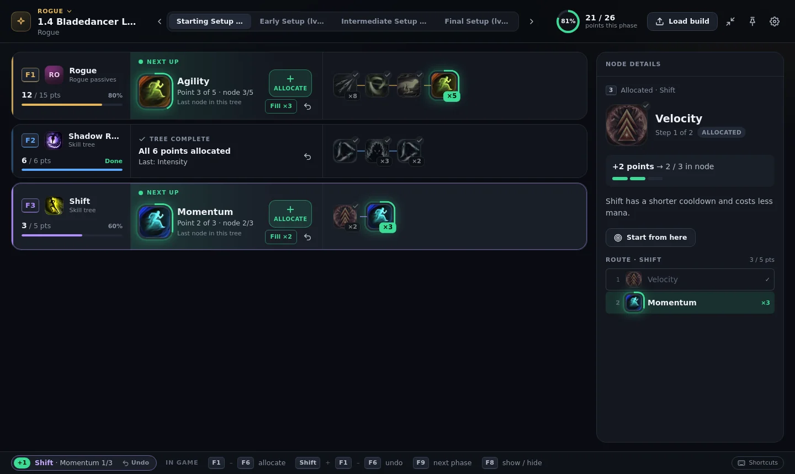

# LE Build Planner

A desktop companion for **Last Epoch**. Load your build from a [Maxroll planner](https://maxroll.gg/last-epoch/planner) link and follow it point by point while you play. Every tree (the class passive tree and all five skills) is in one view, and the node to allocate **next** in each tree is shown big and green.

- **Read it at a glance.** One lane per tree: its progress, the node to take next (and what comes after), and the whole route as a strip of nodes. Green always means "allocate this next".
- **Never leave the game.** Press `F1`–`F6` in game to tick a point off in trees 1–6 (`Shift` undoes). A short sound confirms each press, so you don't have to look.
- **Mini mode.** A small, always-on-top window for a corner of the screen: one line per tree with the next node and its key.
- **Leveling → Endgame.** A build can have up to 6 phases. When you switch phase, the app keeps your progress where the routes overlap and tells you exactly what to respec, and which mastery to pick.
- **Every character.** Your main, your alts and your next-season character each keep their own build and progress.
- **Guides that change.** When the author edits the Maxroll guide, the app shows you what changed and applies it only if you agree, keeping your progress.

---

## Getting started

### Install

Download the latest version from the [Releases page](https://github.com/Artzzx/le-build-overlay/releases/latest) (Windows 10/11, 64-bit):

- **`LE-Build-Planner-Setup-x.y.z.exe`** (recommended) installs the app and **keeps it up to date by itself**.
- **`LE-Build-Planner-Portable-x.y.z.exe`** runs without installing. It tells you when a new version is out, but you download it yourself.

The app isn't code-signed yet, so Windows SmartScreen may warn the first time: click **More info → Run anyway**.

### Updates

New versions (fixes, and new game data after each patch or season) download **in the background**. The status bar then shows **Update ready — restart**:

- Click it to restart into the new version now.
- Or keep playing: it installs the next time you close the app.

The app never restarts on its own. You can turn automatic updates off, or check right now, in **Settings › Updates**.

**What's new** (bottom right of the window) lists what changed in every version: **by version**, marked *minor update* (new features) or *patch* (fixes), or **by feature**, to follow one part of the app over time. After an update, it lights up until you've had a look.

### First start

1. **Copy your build's Maxroll link**, e.g. `https://maxroll.gg/last-epoch/planner/sb62zd0e`.
2. In the app, click **Load build** (`Ctrl`+`O`), choose **From a Maxroll link**, paste the link and press **Fetch**. If the link is already on your clipboard, the app offers **Fetch this build** straight away.
3. **Tick the variants you want.** Each one (*Starting Setup*, *Early Setup*, … *Final Setup*) becomes a phase. Then click **Load**.

The game needs to run in **Windowed** or **Borderless** mode for the app to stay visible on top of it. Put the app on a second monitor, or use mini mode (`Ctrl`+`M`) in a corner of the screen.

Just curious? **Try the example build** on the start screen.

---

## Using it while you play

### Allocating points

Put a point in the game, then press that tree's key: `F1` for the first lane, `F2` for the second, and so on (the key is shown on each lane). You don't need to switch windows; the keys work while the game has focus.

- **Undo** with `Shift`+ the same key, or `Ctrl`+`Z` in the app.
- **Sounds**: a tick per point, a chime when a step or a tree is done, and a low buzz when nothing happened (the tree is finished, say).
- **The status bar** shows your last change (`+1 Shadow Rend · Intensity 2/3`) with an **Undo** button.
- **Fill ×N** puts every remaining point of a multi-point node in at once.
- **Holding a key down** never burns through points.

### Already levelled? Catch the app up

Click the node you're actually at in a tree, then **Start from here**. The app marks everything before it as done.

### Phases

The phase tabs at the top switch between *Leveling*, *Endgame*, and so on (also `F9` / `Shift`+`F9` in game, or `PgDn` / `PgUp` in the app).

When you switch, the app compares what your character already has with the new phase:

- **Every point you already hold is kept** when the new route still wants it, even if the guide takes it in a different order.
- **Respec** lists only the points the new route doesn't use at all, **node by node**, numbered in the order to take them off (the last one you took comes off first, so the game never blocks you).
- **Skills** the phase doesn't use stay specialized if you have a free slot (slots open at levels 4, 8, 20, 35 and 50) and the skill comes back later, with its points. Otherwise the banner tells you to despecialize it.
- **Mastery**: when to choose it, or change it.

The banner stays until you close it: **Done** when you've done it in game, or **×** if you switched by mistake (nothing changes then). It stays when you allocate points, change phase or restart the app. Going back to an earlier phase asks for nothing and forgets nothing. When every tree in a phase is done, the app offers to move to the next one.

### Mini mode

`Ctrl`+`M` switches to a small window that stays on top. It has one line per tree with the next node and its key. Click a line to allocate, right-click to undo. `Ctrl`+`M` again goes back. It remembers its own size and position, and `Esc` never kicks you out of it.

### Characters

The name above the build (top left) opens your **characters**. Each keeps its own build and progress.

- **Switch**: click a character.
- **New character**: starts empty and opens *Load build*.
- **Rename**: give it your in-game character's name.
- **Delete**: removes a character and its progress (the last one can't be deleted).

When you load a build, **Load into** (at the bottom of the window) picks *this character* or a *new character*. It chooses *new character* by itself when the build is a different class, so loading an alt never wipes your main.

### Guide updates

For builds loaded from a Maxroll link, the app checks once a day, when it starts, whether the author edited the guide. If they did, you get a **Review** button:

- It lists, phase by phase, what changed: points added, a route changed after point 8, a skill swapped, a new mastery.
- **Apply update** keeps every point you've allocated on the unchanged part of each route. If something you already took changed, a banner tells you what to respec. There's an **Undo**.
- **Keep my version** leaves your build as it is and stops offering that version.

To check right now, open the characters menu and choose **Check the guide for updates**. To turn the daily check off, go to **Settings › Guide updates**.

### Two guides in one build

Following one guide for leveling and another for endgame? Put both in the same build:

1. Fetch one guide's link and tick the variants you want from it.
2. Click **Add another guide** (under the variants).
3. In the phase list, click **Add another guide** again, paste the other guide's link, fetch it, tick its variants and click **Add**.
4. Put the phases in order: select one and use the arrows next to its name (or `Alt`+`↑`/`↓`). Then **Load**.

Each phase shows which guide it came from, and the app checks **every** guide for updates. All phases must be the same class. You can have up to 6 phases in total.

### Share a build

Set up a build you like, two guides and all? Share it:

- **Share**: open the characters menu and choose **Share this build**. A short code (`LEBP1.…`) is copied. Paste it anywhere: Discord, Reddit, a message.
- **Load one**: **Load build › From a share code**, paste it, check the phases, then **Load** (into a new character if you like). If the code is on your clipboard, the app offers it right away.

A share code holds the plan, never anyone's progress. Its guides are fetched fresh from Maxroll, so you get their latest version, and their updates later. If Maxroll can't be reached, or the author has since deleted a variant, the app uses the route as it was shared.

*Paste export codes* was retired in 0.4: builds come from Maxroll links or share codes. Templates you saved before still open from **Load build**.

---

## After a major game patch

Big patches rework trees, move nodes and add skills. The first time you play after one:

1. **Get the app update.** New game data (trees, node names, icons) comes with an app update, usually shortly after the patch; it downloads by itself (see [Updates](#updates)). Until you have it, a reworked skill can show **No tree data**, and changed nodes can show their old names. The first time the app starts with the new data, it shows a short **Game data updated** card with these steps.
2. **Your characters and progress are kept.** Nothing is reset by an update.
3. **Check your guide.** Open the characters menu and choose **Check the guide for updates**. Authors usually update their planners within days of a patch. Review the changes, then apply them. The banner lists what to respec in game.
4. **If the patch refunded your points in game**, set each tree back to where you really are: click the node you're at, then **Start from here**. To start a tree over, undo it back to 0.
5. **A skill still shows "No tree data", or Load build warns that points "don't fit the tree"?** Either the guide hasn't been updated for the patch yet, or your app is older than the patch. Check again later.
6. **New season or cycle?** Make a **new character** for it (**Load into › New character**). Your old character keeps its own build and progress.

---

## Controls

| | In game | In the app |
|---|---|---|
| Allocate a point | `F1`–`F6` | `1`–`6` or `F1`–`F6`, **Allocate**, or `Enter` on the focused tree |
| Undo a point | `Shift`+`F1`–`F6` | `Shift`+`1`–`6`, the undo button, or `Backspace` |
| Fill the whole node | — | `Ctrl`+`1`–`6`, `Ctrl`+`Enter`, or **Fill ×N** |
| Undo the last change (any tree) | — | `Ctrl`+`Z` or **Undo** in the status bar |
| Clear all progress (every phase) | — | `Ctrl`+`Shift`+`Delete`, or **Clear all progress** in the characters menu. It asks first, then offers Undo |
| Next / previous phase | `F9` / `Shift`+`F9` | the phase tabs, or `PgDn` / `PgUp` |
| Show / hide the window | `F8` | — |
| Mini mode ↔ full window | — | `Ctrl`+`M` |
| Move between trees / nodes | — | `↑` `↓` / `←` `→`, `Esc` to go back |
| Load build · Settings · all shortcuts | — | `Ctrl`+`O` · `Ctrl`+`,` · `?` |
| Interface size | — | `Ctrl`+`=` / `Ctrl`+`-` / `Ctrl`+`0` |

Every in-game key can be changed in **Settings**:

- **Lane keys** can be `F1`–`F6` (the default), `1`–`6`, or numpad `1`–`6`.
- **Arm first** mode: press `` ` `` first, and the lane keys work for 5 seconds. The game keeps those keys the rest of the time.
- Settings refuses to save a key assigned to two actions.

## Settings

`Ctrl`+`,`, or the gear icon:

- **Display**: interface size, keep on top, mini mode opacity.
- **Sound**: hotkey sounds and their volume.
- **Guide updates**: the daily Maxroll check.
- **Global hotkeys**: turn them on or off, choose the lane keys, direct or arm-first mode, the modifiers, and the show/hide and phase keys.

## Your data

Your characters, settings and templates are stored on your computer, in `%APPDATA%\le-build-overlay` on Windows. Nothing is uploaded. The app only contacts Maxroll to fetch a build you asked for, and for the daily guide check, which you can turn off.

---

## Troubleshooting

**A key does nothing in game.** Another program may already use it. The status bar shows *Hotkey unavailable* with the key; open **Settings** and pick another one.

**The F-keys don't work on my laptop.** Your keyboard sends media keys by default. Turn on **Fn Lock** (often `Fn`+`Esc`), or switch the lane keys to numpad or `1`–`6` in Settings.

**My number keys stopped working in game or in chat.** Your lane keys are set to `1`–`6`, so the app takes those keys. Switch to `F1`–`F6` in Settings, or use **Arm first**.

**The app window disappears behind the game.** Run the game in **Windowed** or **Borderless** mode, and turn on **Keep on top** (the pin icon), or use mini mode. `F8` shows or hides the window.

**No sounds.** Open **Settings › Sound** and press **Test**. Sounds only play for keys pressed *in game*; clicks and keys in the app are silent on purpose.

**Mini mode isn't see-through.** Opacity only works on Windows and macOS.

**"Couldn't import this planner".** Check that the link opens in your browser, and that the planner is public or unlisted. If Maxroll is down, try again later; a friend's share code still loads (from its shared routes) while Maxroll is unreachable.

**A tree says "No tree data".** That skill isn't in the app's game data yet. It's usually new in a patch: see [After a major game patch](#after-a-major-game-patch).

---

## For developers

Running from source needs [Node.js](https://nodejs.org) 22.12+: `npm install`, then `npm start` (`npm run dev` opens DevTools). `npm test` runs the test suite. The architecture, data formats, the data pipeline and the release process are in [CLAUDE.md](CLAUDE.md).
